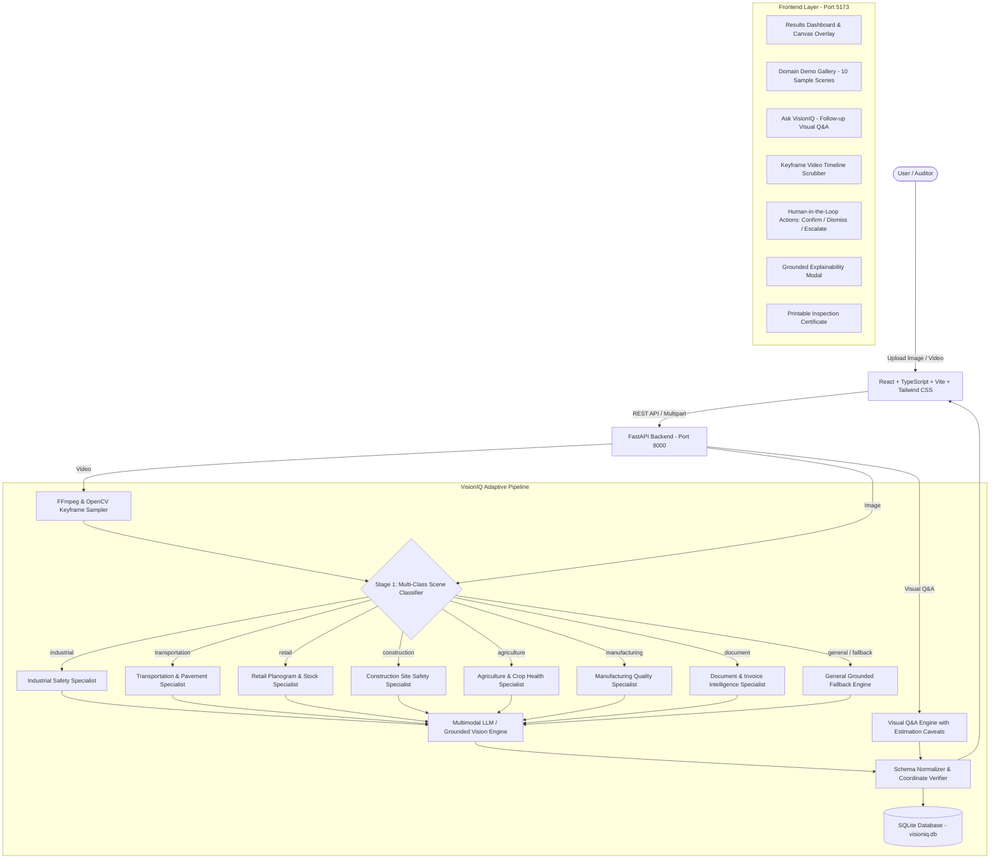

# VisionIQ — Adaptive Visual Intelligence Engine
*Upload anything. Understand everything. Act intelligently.*

VisionIQ is a full-stack, domain-adaptive visual intelligence platform powered by multimodal reasoning (Google Gemini, Anthropic Claude, and OpenAI GPT-4o). Instead of requiring users to choose specialized computer vision pipelines, VisionIQ automatically inspects incoming images or videos, classifies the scene context, runs domain-adaptive anomaly detection, delivers structured findings with strict observation vs. interpretation separation, and supports interactive Visual Question Answering ("Ask VisionIQ").

---

## 🏛️ System Architecture



---

## ✨ Key Features

1. **Automatic Anomaly Detection on Every Upload**:
   - Analyzes every image and video immediately upon upload without requiring manual configuration.
   - Outputs strict, standardized schemas:
     ```json
     {
       "scene": { "type": "string", "confidence": "high | medium | low" },
       "findings": [
         {
           "title": "string",
           "severity": "low | medium | high | critical",
           "confidence": "high | medium | low",
           "observation": "string",
           "interpretation": "string",
           "recommendation": "string",
           "bounding_box": [ymin, xmin, ymax, xmax]
         }
       ],
       "executive_summary": "string"
     }
     ```

2. **"Ask VisionIQ" — Interactive Visual Q&A**:
   - Ask custom questions about any uploaded photo or video (e.g., *"How many parking slots are free vs occupied?"*, *"How many boxes need restocking?"*).
   - Strict counting & estimation handling: Counting questions are framed with approximation bounds and explicit caveat callouts when perspective, occlusions, or distance introduce uncertainty.
   - Structured Q&A schema:
     ```json
     {
       "answer": "direct answer to the question",
       "observation": "what was visually seen that supports this answer",
       "confidence": "high | medium | low",
       "caveat": "optional note on estimations or occlusions"
     }
     ```

3. **Dual-Engine Video Processing (FFmpeg + OpenCV)**:
   - Robust temporal keyframe extraction with automatic OpenCV fallback if FFmpeg is unavailable or encounters codec errors.
   - Video timeline visualization with interactive scrubber and per-timestamp finding markers.

4. **Multi-Provider AI Architecture**:
   - Native support for Google Gemini (`gemini-3.6-flash`, `gemini-3.1-flash-lite`, `gemini-3-flash-preview`), Anthropic Claude (`claude-3-7-sonnet`), and OpenAI (`gpt-4o`).
   - Dynamic model fallback preventing 429 quota deadlocks.

5. **Auditing & Human-in-the-Loop (HITL)**:
   - Mark findings as *Confirmed*, *Dismissed*, or *Escalated*.
   - Deep-dive "Why did you flag this?" explainability modal.
   - Persistent SQLite history audit log.
   - Printable formal Visual Inspection Reports.

---

## 🛡️ Grounding Contract

- **Strict Triad Separation**:
  - **Observation**: What is physically and verifiably observable in the pixels.
  - **Interpretation**: Contextual meaning, hedged appropriately (*e.g., "may indicate", "could represent"*).
  - **Recommendation**: Pragmatic next step or maintenance action.
- **Zero Coordinate Fabrication**: Bounding boxes are rendered exclusively when exact visual coordinates are returned.
- **Domain Mismatch Protection**: Domestic or non-industrial imagery is classified as `general` without hallucinating industrial defects or pavement distress.

---

## 🚀 Quick Start Guide

### Prerequisites
- **Python**: 3.10+ (tested on Python 3.12)
- **Node.js**: 18+ (tested on Node v20/v24)
- **FFmpeg** *(Optional but recommended)*: Available in system `PATH` (OpenCV fallback is active if FFmpeg is not installed)

---

### 1. Installation

#### Clone Repository
```bash
git clone https://github.com/saivarshith-cloud/visionIQ.git
cd visionIQ
```

#### Backend Setup
```bash
cd backend
python -m venv venv
# On Windows (PowerShell):
.\venv\Scripts\Activate.ps1
# On Linux/macOS:
source venv/bin/activate

pip install -r requirements.txt
cp .env.example .env
```

#### Frontend Setup
```bash
cd ../frontend
npm install
```

---

### 2. Configuration (`.env`)

Add your preferred Multimodal AI API key in `backend/.env`:
```env
# Multimodal LLM Secrets
GEMINI_API_KEY=your_gemini_api_key_here
# ANTHROPIC_API_KEY=your_anthropic_api_key_here
# OPENAI_API_KEY=your_openai_api_key_here

# Backend Config
BACKEND_HOST=0.0.0.0
BACKEND_PORT=8000
CORS_ORIGINS=http://localhost:5173,http://127.0.0.1:5173
```

---

### 3. Running Locally

#### Start Backend (Terminal 1)
```bash
cd backend
python -m uvicorn main:app --host 127.0.0.1 --port 8000 --reload
```
API running at: `http://127.0.0.1:8000` (Interactive Swagger docs: `http://127.0.0.1:8000/docs`).

#### Start Frontend (Terminal 2)
```bash
cd frontend
npm run dev
```
Frontend UI running at: `http://localhost:5173`.

---

## ⚙️ Configuration & Deployment References

For production deployment or port adjustments, refer to these file locations:

| Setting | Configuration File | Description |
| :--- | :--- | :--- |
| **Backend CORS Origins** | [`backend/main.py`](backend/main.py) & [`backend/config.py`](backend/config.py) | Configured via `CORS_ORIGINS` in `.env` and `app.add_middleware(CORSMiddleware)` |
| **Frontend API Base URL** | [`frontend/src/config.ts`](frontend/src/config.ts) | Controlled via `VITE_API_BASE_URL` (defaults to `http://localhost:8000`) |
| **Environment Template** | [`.env.example`](.env.example) & [`backend/.env.example`](backend/.env.example) | Template for API keys and host configurations |

---

## 🧪 Automated Test Suites

VisionIQ comes with automated test suites verifying all core capabilities:

```bash
# Run Core Loop & Grounding Verification
python backend/tests/test_phase1.py

# Run Video Sampling, HITL & Explainability Tests
python backend/tests/test_phase2_3.py

# Run Automatic Detection & Visual Q&A Tests
python backend/tests/test_qa_and_automatic_detection.py

# Run Video Upload, OpenCV Fallback & Video Q&A Tests
python backend/tests/test_video_upload_and_qa.py
```

---

## 📄 License

MIT License. Developed for advanced multimodal visual intelligence.
